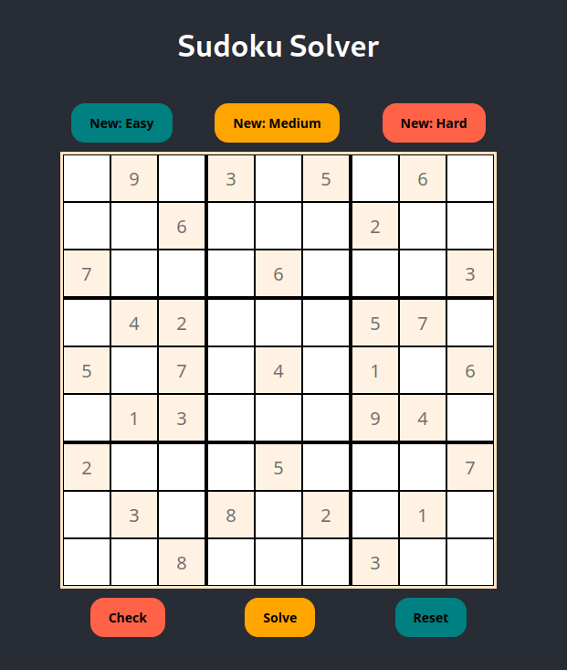

# SudokuGame
A Sudoku game in JavaScript

This was made using a RESTful Express.js API and a React front-end. To generate new boards, the API takes a difficulty string in the url parameter and reads a .txt file as a seed to the sudoku puzzle. The API then performs a series of transformations on the puzzle to produce a seemingly new puzzle.

The transformations done on the puzzle include:
- Mapping numbers (eg. all '1s' become '3s' and all '2s' become '8s')
- Rotating the board
- Shuffling rows and columns


## Table of Contents

- [Installation](#installation)
- [Usage](#usage)
- [License](#license)

## Installation

1. Check if you have Node.js installed. If you do not have node installed, follow the directions at https://nodejs.org/en
```bash
$ node --version
  v18.15.0
```

2. Copy the files from this github repository by downloading the zip file or by running the git clone command
```bash
$ git clone https://github.com/kevinngkaion/SudokuGame.git
```

3. cd into the project directory and then into the backend directory
```bash
$ cd directory_where_game_was_copied_to/SudokuGame/sudoku/backend
```

4. Install the neccessary dependencies for the Express API
```bash
$ npm install
```

5. Run the express server
```bash
$ npm start
```

6. In a new terminal, cd into the project directory
``` bash
$ cd directory_where_game_was_copied_to/SudokuGame/sudoku
```

7. Install the neccessary dependencies for the React app
``` bash
$ npm install
```

8. Run the react app
```bash
$ npm start
```

## Usage


+ Solve the puzzle by entering your answers in the available cells
+ Check if your answers are correct by clicking the 'check' button below the board. Correct answers will change colour and can no longer be changed
+ If you get stuck, you can solve the puzzle by clicking the 'solve' button
+ Reset the board back to the original puzzle by clicking the 'reset' button
+ Get a new puzzle by clicking one of the buttons above the board. You can select the puzzle difficulty as well

## License
This project is licenced under the GNU General Public License v3.0